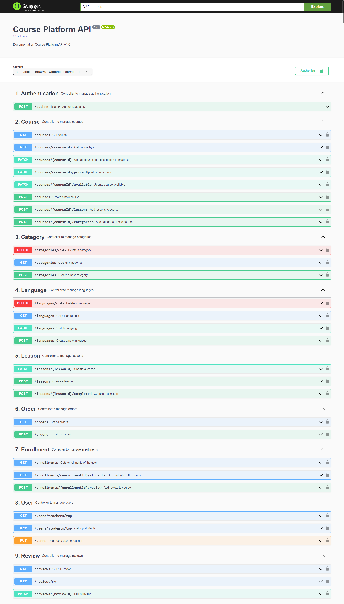

# ByteLearn Backend API
This is the backend of the ByteLearn project, which is developed with Spring Boot.

**Frontend Repository: [ByteLearn Frontend](https://github.com/ericcasane/ByteLearn-Frontend)**

**Frontend Link: [ByteLearn Frontend](https://bytelearn-platform.vercel.app/)** (It actually doesn't work correctly because the backend is not deployed in a server.)

**Project Video: [ByteLearn Video](https://youtu.be/vFWb5POg2_k)**

## Features

1. **Authentication**: The API uses a token-based authentication scheme (Bearer Authentication).
2. **Security**: The API uses Spring Security annotations to protect endpoints and limit access based on roles and authorities.
3. **Swagger**: The API uses Swagger annotations for API documentation.
4. **REST Controllers**: The API provides several REST controllers to handle different entities, including:
    - Courses
    - Categories
    - Languages
    - Lessons
    - Orders
    - Enrollments
    - Reviews
    - Users
5. **CRUD Operations**: The API allows CRUD (Create, Read, Update, Delete) operations on various entities.
6. **Pagination**: The API supports pagination of results.
7. **Filtering and Search**: The API allows filtering and searching courses by title, description, language, and category.
8. **Role and Privilege Management**: The API allows management of user roles and privileges.
9. **Enrollment and Review Management**: The API allows users to enroll in courses, complete lessons, and leave reviews.
10. **Order Management**: The API allows users to create orders.

Please note that this is a general list based on the provided code snippets. For a complete and detailed list of features, I would recommend reviewing the full API documentation with SwaggerUi and source code.

## Cloning the Repository

To clone this repository, open your terminal and run the following command:

```bash
git clone https://github.com/ericcasane/ByteLearn-Spring-Backend
cd ByteLearn-Spring-Backend
```

## Running the Project

To run the project, you can use an IDE like IntelliJ IDEA or Eclipse on the folder erjose-app. 

You can use the following command to run the project:

```bash
mvn spring-boot:run
```

This will start the Spring Boot application on http://localhost:8080.

## API Documentation

This API uses Swagger 2 for API documentation. You can access the Swagger UI by visiting the following URL:

http://localhost:8080/swagger-ui/index.html

This will open the Swagger UI, where you can see all the available endpoints, models, and make test requests.

Image of the Swagger UI:



## Project Sprint Status
- Sprint 1 
    - Generated by Sergio Benages
    - Verified by Eric Casañé
    - Communicated by Joaquín Catanzariti
    - Video 1: https://youtu.be/sIADNe9ZF2c
- Sprint 1.5 
    - Generated by Joaquín Catanzariti
    - Verified by Sergio Benages
    - Communicated by Eric Casañé
- Sprint 2 
    - Generated, verified and communicated by Eric Casañé
    - Video 2: https://youtu.be/uQqtM-hs1-I
- Sprint 3 
    - Generated, verified and communicated by Eric Casañé
    - Video 3: https://youtu.be/wDhxXNdvHlc
- Sprint 4 
    - Generated, verified and communicated by Eric Casañé
- Final sprint
    - Generated, verified and communicated by Eric Casañé 
    - New:
        - Frontend with NextJS and NextUI: https://bytelearn-platform.vercel.app
        - Sprig Boot Api: (Swagger UI) -> https://erjose-api-bytelearn-api.azuremicroservices.io/swagger-ui/index.html
        - Frontend deployed in Vercel and Sprig Boot Api in Azure
        - MySQL Database
        - Added pagination
        - Others
    - Final video: https://youtu.be/vFWb5POg2_k
        
- **Youtube playlist:** https://www.youtube.com/playlist?list=PLCK4SaVBn5pfC1oPSkh3HKax94j3WpalE


## Endpoints table
| HTTP Method | Endpoint | Description |
| --- | --- | --- |
| GET | /reviews |  |
| GET | /reviews/my |  |
| PATCH | /reviews/{reviewId} |  |
| GET | /enrollments |  |
| POST | /enrollments/{enrollmentId}/review |  |
| GET | /enrollments/{enrollmentId}/students |  |
| GET | /orders |  |
| POST | /orders |  |
| POST | /lessons |  |
| PATCH | /lessons/{lessonId} |  |
| POST | /lessons/{lessonId}/completed |  |
| PUT | /users |  |
| GET | /users/students/top |  |
| GET | /users/teachers/top |  |
| POST | /authenticate |  |
| GET | /categories |  |
| POST | /categories |  |
| DELETE | /categories/{id} |  |
| GET | /courses | Get all courses |
| POST | /courses | Create a new course |
| GET | /courses/{courseId} |  |
| PATCH | /courses/{courseId} | Update course title, description or image url |
| PATCH | /courses/{courseId}/available | Update course availability |
| POST | /courses/{courseId}/categories |  |
| POST | /courses/{courseId}/lessons |  |
| PATCH | /courses/{courseId}/price | Update course price |
| GET | /languages |  |
| POST | /languages |  |
| PATCH | /languages |  |
| DELETE | /languages/{id} |  |

## Privileges table
| Privileges           | Guest | Student | Teacher | Admin |
|----------------------|-------|---------|---------|-------|
| READ_ALL_COURSES      |   [ ]   |   [ ]   |   [x]   |  [x]  |
| READ_AVAILABLE_COURSES|   [x]   |   [x]   |   [x]   |  [x]  |
| READ_OWN_COURSES      |   [ ]   |   [x]   |   [ ]   |  [ ]  |
More privileges . . .


*Created with ❤️ by Eric Casañé*
